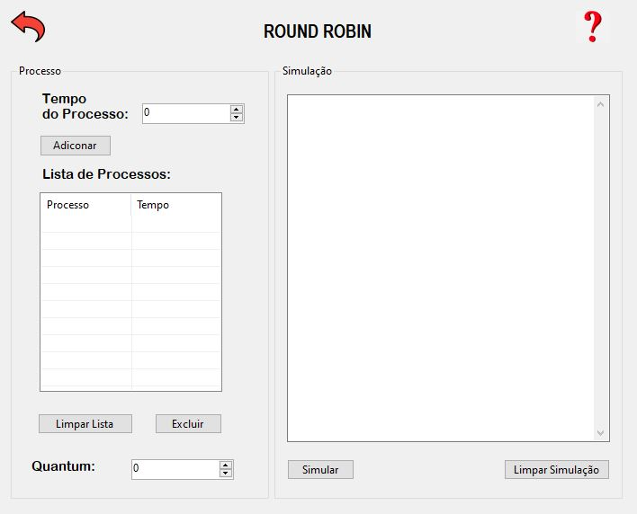
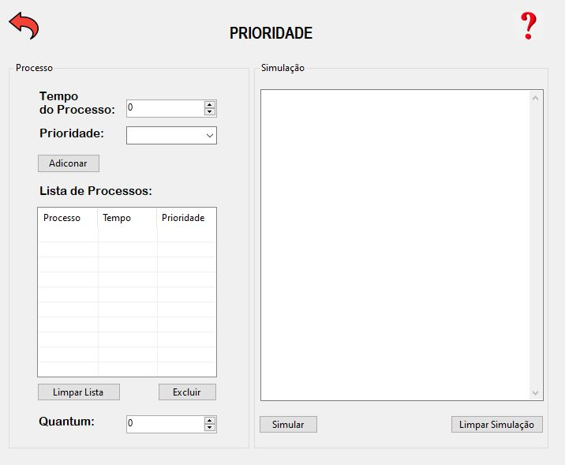
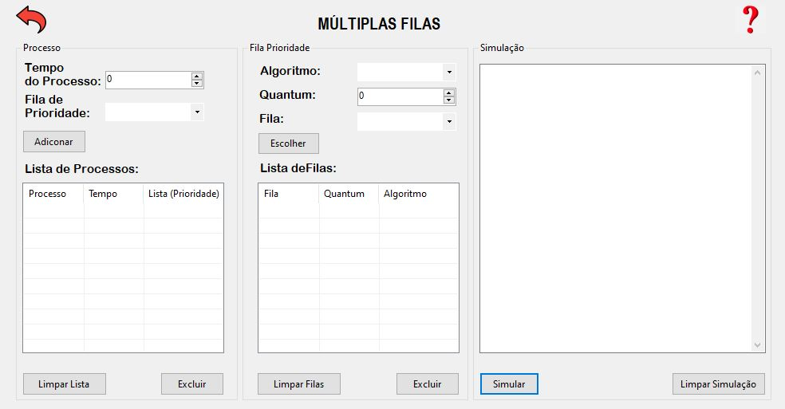
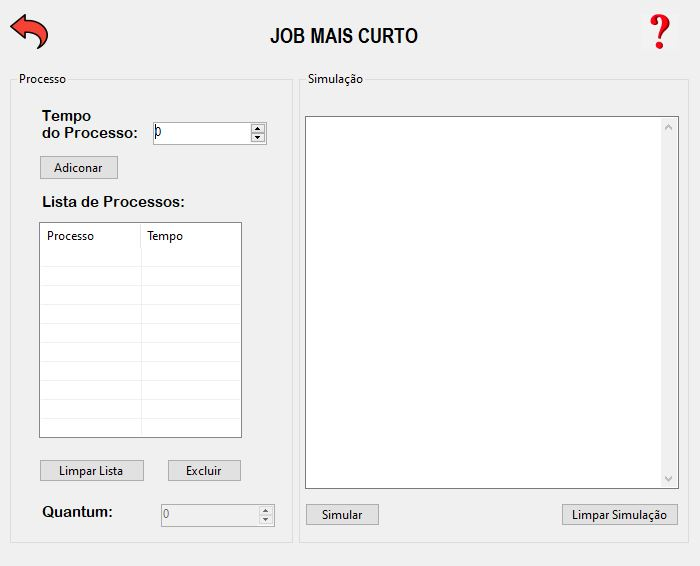
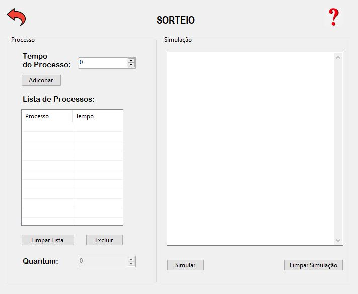

## :mag: Simulador de Escalonamento de Processos
Este repositório contém um projeto que simula vários algoritmos de escanamento de processos.

## Interface :desktop_computer: 
 Desenvolvido em C# utilizando a ferramenta Visual Studio, a interface gráfica tem um design básico do Windows Forms. E conta com:
 - Forms para cada Algoritmo;
 - Lista de Processos;
 - Espaço para visualizar a simulação;
 - No caso do Form de múltiplas filas, terá mais atributos e grupos de acesso em comparação aos outros;
 - Área para adicionar cada processo.
 
 ### :large_orange_diamond: Menu
  O menu é a área de escolha do algoritmo que vai ser utilizado.
  
  
### :large_orange_diamond: ROUND ROBIN
 Nesta tela, é possível o usuário adicionar a cada processo, um tempo de execução. Após adicionar todos os processos desejados à lista de processos, o usuário escolhe o quantum
que deseja fazer a simulação. Após essas configurações é só clicar no botão "Simular".

  
### :large_orange_diamond: PRIORIDADE
 Nesta tela, é possível o usuário adicionar a cada processo, um tempo de execução e um grau de prioridade representada em números, sendo 1 prioridade alta e 10 baixa. Após adicionar todos os processos desejados à lista de processos, o usuário escolhe o quantum
que deseja fazer a simulação. Após essas configurações é só clicar no botão "Simular".

  
### :large_orange_diamond: MÚLTIPLAS FILAS
 Já nesta tela, existem algumas configurações a mais, como por exemplo a escolha de algoritmo de escalonamento de cada fila. Após adicionar os processos às suas respectivas filas de prioridade, o usuário poderá selecionar o algoritmo desejado para escalonar cada fila. Semelhante as outras telas, existe a escolha do quantum para cada fila. Após essas configurações é só clicar no botão "Simular".
 
  
### :large_orange_diamond: JOB MAIS CURTO
 Nesta tela, é possível o usuário adicionar a cada processo um tempo de execução. Após adicionar todos os processos desejados à lista de processos é só clicar no botão "Simular".
 
  
### :large_orange_diamond: SORTEIO
 Nesta tela, é possível o usuário adicionar a cada processo um tempo de execução. Após adicionar todos os processos desejados à lista de processos é só clicar no botão "Simular".
 
  

## Dicas de como usar :question:
 1. Para limpar a simulação, é só clicar no botão "Limpar Simulação";
 2. Para obter ajuda, clique no botão :question:;
 3. Para voltar para a o menu, clique no botão :back: em vermelho;
 4. Para fechar a aplicação, clique no botão :x:;
 5. É possível excluir um processo. Selecione a linha do processo que deseja excluir e clique no botão "Excluir";
 6. É possível limpar a lista de processo, somente clicando no botão "Limpar Lista";
 7. Na tela de Múltiplas fila, para fazer a simulação é preciso que todas as filas que exitem processos tenham um algoritmo e quantum escolhido. Isso após adicionar todos os processos na lista de processos.
 
 
## Algoritmos :books:
### :white_medium_square: ROUND ROBIN
  Cada processo recebe um intervalo de tempo (quantum) e se o processo ainda está rodando quando seu quantum terminar (ou se o processo bloqueie ou termine antes de acabar), a UCP é tomada deste processo e o escalonador seleciona um novo para rodar. O escalonador mantém uma lista de processos executáveis (que estão prontos) e quando o quantum termina sem o processo terminar, o mesmo é colocado no fim dessa lista. O escalonador sempre seleciona o primeiro processo dessa lista para execução. O valor do quantum deve ser escolhido cuidadosamente, se o valor do quantum for muito pequeno, teremos grande parte do tempo de execução da UCP gasta com o processo de chaveamento, e se o valor for muito grande, isto gera um tempo de resposta muito grande para usuários interativos. Processo com muita utilização da UCP devem ganhar maior quantum, para reduzir o número de chaveamento executado nesse processo. O grande problema aqui é o que o SO trata igualmente todos os processos, seja ele de pouca importância ou de grande importância.
  
### :white_medium_square: PRIORIDADE
  A prioridade serve para oferecer um tratamento distinto à processos diversos. No instante da criação de um processo ele recebe uma prioridade. E o quando o escalonador tiver que escolher qual processo será executado, escolherá o de mais alta prioridade. Cada vez que o processo é executado, o escalonador decrementa sua prioridade e quando sua prioridade fica abaixo de um outro processo pronto, ele é interrompido e o outro processo é executado.
  
### :white_medium_square: MÚLTIPLAS FILAS
  Devemos estabelecer classes de prioridades. Os processos de classes mais altas são escolhidos para execução mais freqüentemente que os de classe mais baixas (recebem um número maior de quanta para processamento). Os processos da classe mais alta existente recebem 1 quantum, a classe abaixo recebe 2, a outra 4 e assim sucessivamente na potência de 2. Quando o processo utiliza todos os quanta que recebeu, ele é abaixado de uma classe (fazendo com que seja escolhido menos freqüentemente, mas execute durante mais tempo). Ex: num processo que necessita de 100 quanta para executar, teremos execuções de 1, 2, 4, 8, 16, 32, 37 (totalizando 100), isto é, ele é selecionado para execução 7 vezes (7 chaveamentos para este processo). Se fosse no método Round-Robin ele seria selecionado 100 vezes até acabar. Surgiu um inconveniente: se um processo começa com grande quantidade de cálculos, mas depois se torna interativo (comunicação com o usuário), teríamos um tempo de resposta ruim. Para eliminar este problema, foi implementado mais um método que seria o seguinte: cada vez que um é teclado no terminal de um processo, este processo é transferido para a classe de prioridade mais alta (pois se tornou interativo). Mas depois um usuário descobriu que durante a execução de um processo grande, bastava teclar no terminal aleatoriamente para ter o tempo de execução melhorado.
  
### :white_medium_square: JOB MAIS CURTO
  É útil para sistemas de lotes (batch), pois muitas vezes o usuário já sabe estimar o tempo de execução dos programas (pois os programas são rodados constantemente). O escalonador escolhe para execução entre todos os jobs disponíveis, aquele de menor tempo de execução. EX: Existem quatro jobs disponíveis (A, B, C, D). O A demora 8 minutos para executar e os demais, 4 minutos cada. Se o job de 8 minutos for escolhido antes, teríamos:

- Tempo de resposta de A: 8 minutos
- Tempo de resposta de B: 8 + 4 minutos = 12 minutos
- Tempo de resposta de C: 8 + 4 + 4 minutos = 16 minutos
- Tempo de resposta de D: 8 + 4 + 4 + 4 minutos = 20 minutos
- Tempo médio de resposta = 56/4 = 14 minutos
 
  Utilizando o método Menor Serviço Primeiro vamos ter um tempo médio de reposta igual a 11 minutos! Mesmo que os serviços não são todos conhecidos o tempo de resposta pode não ser o mínimo mas é uma boa aproximação.
  
### :white_medium_square: SORTEIO
  Tem como idéia básica dar bilhetes de loteria para cada processo. Sempre que uma decisão de escalonamento tiver de ser feita, um bilhete de loteria é escolhido aleatoriamente, e o processo que armazena este bilhete recebe o recurso. “Todos os processos são iguais, mas alguns processos são mais iguais”. Os processos mais importantes
podem receber bilhetes extras, para aumentar suas chances de ganhar. 

### :white_medium_square: GARANTIDO
  Se existem n usuários ativos, então, cada um receberá aproximadamente 1/n do tempo de UCP. Para garantir isso devemos usar o seguinte método:

- manter para cada usuário o valor do tempo de UCP que ele já utilizou desde que entrou (tempo utilizado).
- contar quanto tempo já se passou desde que o usuário iniciou sua seção e dividir pelo número de usuários gerando o tempo destinado ao processo (tempo destinado).
- computar para cada usuário a razão entre o tempo utilizado e o tempo destinado (razão).

## :heavy_check_mark: FEITOS 

- [x] ROUND ROBIN
- [x] PRIORIDADE
- [x] MÚLTIPLAS FILAS
- [x] JOB MAIS CURTO
- [x] SORTEIO
- [ ] GARANTIDO

